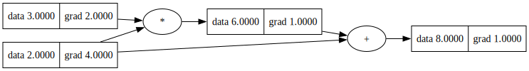

# LEARNINGS.md

> This file documents my exploratory work, flow of thought, mistakes made, and reasoning behind architectural decisions throughout the project. It is written chronologically and is intended to reflect genuine understanding, not polish.

---

## Phase 0 — Building the Tensor Class

### Motivation

The first question I had to answer was: why is backward differentiation necessary at all?

In a neural network, the loss is computed at the very end of the forward pass. To update the weights, we need to know how much each weight contributed to that loss -> which requires computing gradients with respect to every parameter in the network. Doing this manually for each operation would be both error-prone and unscalable. Automatic differentiation solves this by building a record of every operation during the forward pass and using that record to propagate gradients backwards automatically.

### Translating the Chain Rule into Code

Before writing any code, the mathematics had to be clear. The two rules that underpin all of backpropagation are:

**Chain rule for composition:**
```
dy/dx = dy/dt * dt/dx    given y = f(t) and t = g(x)
```

**Chain rule for addition (multivariate):**
```
dy/dx = dz/dx + da/dx    given y = z + a, where both z and a depend on x
```

Every backward rule in the engine is a direct application of one or both of these.

### Implementing Backward Rules

Each operation stores a `_backward` closure that knows how to distribute the incoming gradient to its inputs. Taking `exp` as an example: the derivative of `e^x` with respect to `x` is `e^x` itself, so the backward rule multiplies the output's gradient by the output's value.

**Critical implementation detail:** gradient accumulation must use `+=` rather than `=`.

A tensor can participate in multiple operations. For example, `z = x * x` uses `x` twice. Each operation contributes a separate gradient to `x`. Using `=` would silently overwrite the first contribution with the second, producing incorrect gradients. Using `+=` ensures all contributions are summed, which is what the multivariate chain rule requires. This was discovered through a bug before being properly understood.

### Automating Gradient Propagation

Once individual backward rules existed, the question became how to call them in the right order automatically.

The key insight: any mathematical expression can be represented as a directed acyclic graph (DAG), where nodes are tensors and edges represent operations. If that graph can be traversed in topological order, guaranteeing that every node is visited after all the nodes that depend on it,then calling `_backward` in reverse topological order correctly propagates gradients from the output back to every input.

The topological sort was implemented using a recursive depth-first search with a visited set to prevent revisiting nodes. Reversing the resulting order gives the correct sequence for backward propagation.

### Bugs Encountered

**`_backward` parameter shadowing**
Defining `def _backward(self)` inside `__mul__` caused `self` inside the closure to refer to the function's own parameter rather than the enclosing `Tensor` instance. The fix was removing the parameter entirely ,backward functions are closures, not methods.


**`Not accumulating the gradient**
As mentioned above, not accumulating resulted to overwriting which in turn resulted to wrong results being calculated.

### Tooling Issues (Windows)

**Module not found when running from inside a subfolder**
Running `python viz/graph_viz.py` directly failed because Python's import system resolves modules relative to the directory the script is run from, not where the file lives. The fix was always running from the project root using `python -m viz.graph_viz`.

**Graphviz `ExecutableNotFound` error**
The `graphviz` Python package is a wrapper, it requires the actual Graphviz software to be installed separately and available on the system PATH. On Windows, the installer does not always add the binary to PATH automatically. The temporary fix was:
```powershell
$env:PATH += ";C:\Program Files\Graphviz\bin"
```
The permanent fix was setting the Machine-level PATH variable via PowerShell as Administrator.

---
### Results 
A sanity check was performed to ensure that the backward differentiation works properly. The code was kept simple and can be checked out in `demos\scalar_demo.py`
