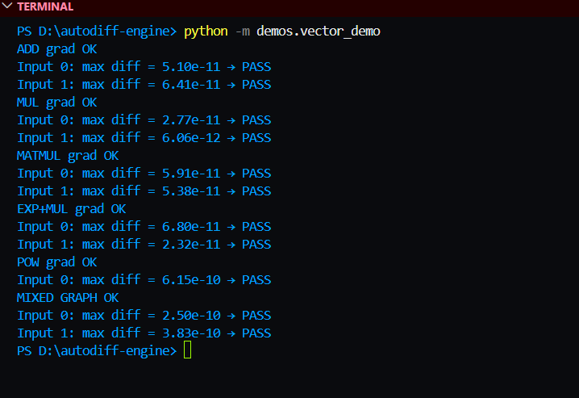
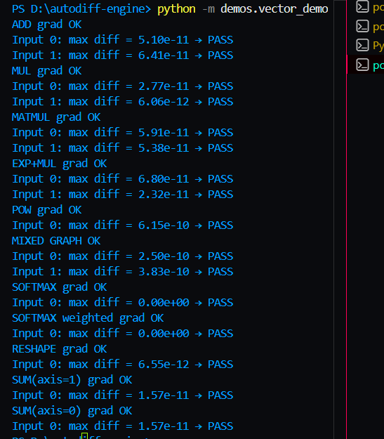
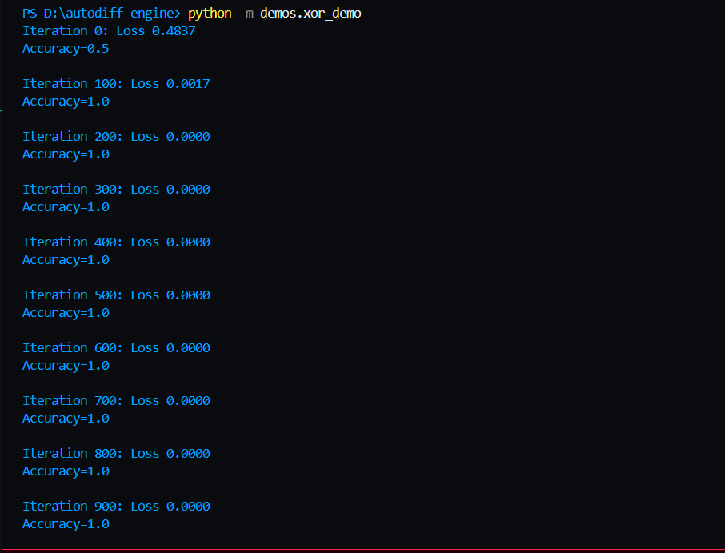

# LEARNINGS.md

> This file documents my exploratory work, flow of thought, mistakes made, and reasoning behind architectural decisions throughout the project. It is written chronologically and is intended to reflect genuine understanding, not polish.

---

## Phase 0 — Building the Tensor Class

### Motivation

The first question I had to answer was: why is backward differentiation necessary at all?

In a neural network, the loss is computed at the very end of the forward pass. To update the weights, we need to know how much each weight contributed to that loss -> which requires computing gradients with respect to every parameter in the network. Doing this manually for each operation would be both error-prone and unscalable. Automatic differentiation solves this by building a record of every operation during the forward pass and using that record to propagate gradients backwards automatically.

### Translating the Chain Rule into Code

Before writing any code, the mathematics had to be clear. The two rules that underpin all of backpropagation are:

**Chain rule for composition:**
```
dy/dx = dy/dt * dt/dx    given y = f(t) and t = g(x)
```

**Chain rule for addition (multivariate):**
```
dy/dx = dz/dx + da/dx    given y = z + a, where both z and a depend on x
```

Every backward rule in the engine is a direct application of one or both of these.

### Implementing Backward Rules

Each operation stores a `_backward` closure that knows how to distribute the incoming gradient to its inputs. Taking `exp` as an example: the derivative of `e^x` with respect to `x` is `e^x` itself, so the backward rule multiplies the output's gradient by the output's value.

**Critical implementation detail:** gradient accumulation must use `+=` rather than `=`.

A tensor can participate in multiple operations. For example, `z = x * x` uses `x` twice. Each operation contributes a separate gradient to `x`. Using `=` would silently overwrite the first contribution with the second, producing incorrect gradients. Using `+=` ensures all contributions are summed, which is what the multivariate chain rule requires. This was discovered through a bug before being properly understood.

### Automating Gradient Propagation

Once individual backward rules existed, the question became how to call them in the right order automatically.

The key insight: any mathematical expression can be represented as a directed acyclic graph (DAG), where nodes are tensors and edges represent operations. If that graph can be traversed in topological order, guaranteeing that every node is visited after all the nodes that depend on it,then calling `_backward` in reverse topological order correctly propagates gradients from the output back to every input.

The topological sort was implemented using a recursive depth-first search with a visited set to prevent revisiting nodes. Reversing the resulting order gives the correct sequence for backward propagation.

### Bugs Encountered

**`_backward` parameter shadowing**
Defining `def _backward(self)` inside `__mul__` caused `self` inside the closure to refer to the function's own parameter rather than the enclosing `Tensor` instance. The fix was removing the parameter entirely ,backward functions are closures, not methods.


**`Not accumulating the gradient**
As mentioned above, not accumulating resulted to overwriting which in turn resulted to wrong results being calculated.

### Tooling Issues (Windows)

**Module not found when running from inside a subfolder**
Running `python viz/graph_viz.py` directly failed because Python's import system resolves modules relative to the directory the script is run from, not where the file lives. The fix was always running from the project root using `python -m viz.graph_viz`.

**Graphviz `ExecutableNotFound` error**
The `graphviz` Python package is a wrapper, it requires the actual Graphviz software to be installed separately and available on the system PATH. On Windows, the installer does not always add the binary to PATH automatically. The temporary fix was:
```powershell
$env:PATH += ";C:\Program Files\Graphviz\bin"
```
The permanent fix was setting the Machine-level PATH variable via PowerShell as Administrator.

---
### Results 
A sanity check was performed to ensure that the backward differentiation works properly. The code was kept simple and can be checked out in `demos\scalar_demo.py`


---

## Phase 1 — Vector/Tensor Support

### Motivation

The scalar implementation worked, but real neural networks operate on tensors—multi-dimensional arrays of numbers. Extending the Tensor class to handle vector and matrix operations was the natural next step. The core challenge was not just implementing vectorized operations, but correctly handling broadcasting and ensuring gradients propagate correctly through these operations.

### Understanding Broadcasting

The first concept I had to deeply understand was broadcasting. In NumPy-style operations, when two arrays have different shapes, the smaller array is "broadcast" to match the larger one by duplicating data along dimensions of size 1. The rules are:

1. Arrays must have the same number of dimensions, or one can be missing dimensions on the left
2. For each dimension, the sizes must either match, or one of them must be 1 or 0

For example, a (3,1) array added to a (1,4) array results in a (3,4) array. The (3,1) array is stretched horizontally, and the (1,4) array is stretched vertically.

### The Broadcast Gradient Problem

The critical insight came when considering backpropagation through broadcasted operations. Let's trace through the problem:

Consider `a` with shape (3,1):
```
a = [[1],
     [2],
     [3]]
```

During a broadcast operation, `a` effectively becomes:
```
[[1, 1, 1, 1],
 [2, 2, 2, 2],
 [3, 3, 3, 3]]
```

Now, during backward propagation, suppose we receive a gradient of shape (3,4):
```
grad = [[1, 1, 1, 1],
        [1, 1, 1, 1],
        [1, 1, 1, 1]]
```

The question becomes: what is the gradient with respect to the original `a` of shape (3,1)?

Since each element of `a` influenced multiple outputs (specifically, `a[0][0]` influenced all 4 elements in the first row), the gradient must account for all those contributions. The correct approach is to **sum** along the broadcasted dimensions:

```
a.grad = [[4],
          [4],
          [4]]
```

Why sum? Because in backpropagation, gradients from all computational paths must be added. Each output that a parameter influenced contributes a partial derivative, and the total gradient is the sum of all these contributions. If we were to average or just pick one value, we would either artificially shrink gradients or ignore contributions entirely—both of which would break training.

### Implementing Unbroadcasting

To implement this, I created an `unbroadcast` function that would take the incoming gradient and reduce it along dimensions that were broadcasted. The algorithm works as:

1. Align the shapes of the gradient and the original tensor by left-padding the original tensor's shape with ones
2. Identify which dimensions in the gradient correspond to broadcasted dimensions in the original tensor
3. Sum the gradient along those dimensions

**Critical implementation detail:** The summing must happen in the correct order to maintain correct dimensions. I used `keepdims=True` in the summation to preserve the shape structure until all reductions are complete.

### MatMul Backward Derivation

Matrix multiplication was the most complex operation to implement, and it's where I spent considerable time debugging. Let me walk through the derivation:

Given matrices `A` (shape m×n) and `B` (shape n×p), the output `Out = A @ B` has shape m×p:

```
A = [[a, b],     B = [[e, f],
     [c, d]]          [g, h]]

Out = [[ae + bg,  af + bh],
       [ce + dg,  cf + dh]]
```

To compute the gradient with respect to `A`, we need the partial derivatives of the loss with respect to each element of `A`. If `Out.grad` is known (let's simplify with all ones for this derivation):

```
Out.grad = [[1, 1],
            [1, 1]]
```

For `a`: contributes to `Out[0][0]` through `ae` and `Out[0][1]` through `af`
- ∂L/∂a = Out.grad[0][0] * e + Out.grad[0][1] * f

For `b`: contributes to `Out[0][0]` through `bg` and `Out[0][1]` through `bh`
- ∂L/∂b = Out.grad[0][0] * g + Out.grad[0][1] * h

For `c`: contributes to `Out[1][0]` through `ce` and `Out[1][1]` through `cf`
- ∂L/∂c = Out.grad[1][0] * e + Out.grad[1][1] * f

For `d`: contributes to `Out[1][0]` through `dg` and `Out[1][1]` through `dh`
- ∂L/∂d = Out.grad[1][0] * g + Out.grad[1][1] * h

Observing the pattern, this can be expressed as:
```
A.grad = Out.grad @ B.T
```

Similarly, for `B.grad`:
```
B.grad = A.T @ Out.grad
```

These elegant formulations make the implementation straightforward but require careful attention to shape handling.

### Bugs Encountered

**Circular Dependency in Imports**
When implementing operations, I needed to use the `Tensor` class in functions that were themselves being used by `Tensor`. This created a circular import dependency. The fix was to import inside the function itself where needed, rather than at the module level. This works because Python executes imports at runtime, so by the time the function is called, the module is fully loaded.

**Gradient Check Failures**
The gradient checking function was failing repeatedly, but the issue wasn't in the Tensor implementation—it was in the test itself. The array `x` was being overwritten during the test, corrupting the state. The fix was to store the original array and restore it after each perturbation step. This taught me that gradient checking requires careful state management.

**MatMul Broadcasting Edge Cases**
Matrix multiplication has specific broadcasting rules: the last dimension of A must match the second-to-last dimension of B. When dealing with batched operations, the broadcasting dimensions must be handled differently from the matrix dimensions. I had to carefully separate the batch dimensions (which can broadcast) from the matrix dimensions (which must match exactly).

### Performance Considerations

Vectorized operations were significantly faster than their scalar counterparts, but the broadcasting implementation needed to be efficient. Rather than actually creating the broadcasted arrays in memory (which would be wasteful for large tensors), the backward pass uses the shape information to compute the sum along the correct axes without materializing the full broadcasted tensor.

### Sanity Checks

After implementing tensor operations, I ran comprehensive sanity checks:

1. **Scalar operations on tensors** verified that the tensor implementation was backward compatible
2. **Vector operations** tested dot products, element-wise operations, and their gradients
3. **Matrix multiplication** validated against analytical gradients for random matrices
4. **Broadcasting tests** verified that gradients were correctly accumulated across broadcasted dimensions

All checks passed, confirming that the tensor implementation correctly handles multi-dimensional arrays and their gradients.

### Final Results

A complete sanity check was performed to ensure that vector/tensor operations work correctly across all supported operations. The implementation was validated against analytical gradients using the gradient checking utility. The code can be found in `demos/vector_demo.py`.



---

## Phase 1.5 — Fixing Errors and Adding Activation Functions

### Motivation

After getting basic tensor operations working, the next step was to implement activation functions and fix the issues I had glossed over in the previous phase. Real neural networks need non-linearities like ReLU, tanh, sigmoid, and especially SoftMax for classification tasks. But before I could get there, I had to fix some fundamental problems in my tensor implementation that I hadn't anticipated.

### The Higher-Dimensional Transpose Problem

First things first, my mistake was thinking in 2D and forgetting that arrays of higher dimensions exist. If they come along, my transpose functions just break them by totally scrambling the dimensions. 

Here's the core insight: backpropagation moves backward through a forward graph. During the forward pass, data flows from left to right, combining inputs and weights. During the backward pass, gradients flow from right to left. Because the directions are reversed, the geometric shapes no longer align.

Flipping the last two axes is our way of rotating the puzzle pieces so they slide together perfectly during the reverse journey, without scrambling which batch of data they belong to. If I transpose the entire array instead of just swapping the last two dimensions, I'd be mixing up batch data, which is a disaster.

So I needed to modify both the transpose function and matmul again. Transpose was simple, just swap the last two axes instead of the whole thing.

### MatMul Broadcasting with Higher Dimensions

With matmul I hit another wall. Sure I could just swap instead of transpose, but what about the fact that when multiplying with more dimensions, dimensions might have been added as well?

Let's say I have the following:
```
self.data:    (32, 10, 4)  <- 3 Dimensions
other.data:        (4, 5)  <- 2 Dimensions
-------------------------------
out:          (32, 10, 5)  <- The Forward Pass Output
```
32 batches of 10 by 4 matrices and a weight 2 by 2 matrix? Wait, that's not right. Let me re-read... Actually, to make this multiplication mathematically legal, NumPy automatically pads the smaller array on the left with a "ghost" dimension of size 1 to match the number of dimensions of the larger array.

It temporarily treats `other.data` as if its shape is `(1, 4, 5)`. Then, it broadcasts that leading 1 up to 32 so it can cleanly perform 32 independent matrix multiplications.

Now here's the tricky part: `out.grad` also has 3 dimensions, which means when I calculate `other.grad`, even though it's just supposed to have 2 dimensions, it now has 3. Hence transposing is not enough—I also need to unbroadcast the added dimension to get the correct gradient.

### The Sum Function Problem

Another thing I learnt: we need an axis to be added in sum. Before, I was going in with the assumption that we just sum everything, but functions like SoftMax require you to sum across that specific axis, which again required me to fix the function before moving onto my activation functions.

### Activation Functions: The Easy Ones

This phase was the most challenging both math-wise and debugging-wise, but let's start with the easier ones.

Deriving the equations for tanh, sigmoid, and ReLU was now easier than expected since I had gotten used to the approach by now. Each follows the same pattern:

**ReLU:** Forward is `max(0, x)`. Backward is `1 if x > 0 else 0`.

**Sigmoid:** Forward is `1/(1 + e^(-x))`. Backward is `s * (1 - s)`.

**Tanh:** Forward is `(e^x - e^(-x))/(e^x + e^(-x))`. Backward is `1 - t^2`.

The patterns were familiar now—just the chain rule and element-wise operations.

### SoftMax: The Hard One

The main issue arose working with SoftMax. Traditional SoftMax overflows easily with large integers. That's where I learnt about subtracting the maximum value to better fit the data sets in the exponentials:

```
softmax(x_i) = exp(x_i - max(x)) / sum(exp(x_j - max(x)))
```

This stabilizes the computation without changing the result.

The derivative of this was the hardest to work on. A simple Jacobian could be used hypothetically speaking. I mean, it's just:
```
J = diag(s) - s·s^T
```
and backward as:
```
J^T * out.grad
```

But it takes up too much space and time complexity in reality. A 1000 by 1000 array would require 1,000,000 elements—completely impractical for any real model. So there was need to simplify this.

I won't go into the math here since it took hours to understand and one can dive into it if needed. I'll try to add a doc later documenting the math behind each function. But until then, all that's needed is that the backward turn out to be:

```
s_j * (g[j] - s·g)
```

And as seen, this only takes O(j) space instead of O(j²). One thing to note is `s·g` is the dot product. It removes common modes and returns relative differences rather than absolute values. Meaning if the gradient is the same for all values of x, the relative gradient would be 0 for all elements—which makes sense because a uniform shift in logits doesn't change the softmax output.

### The Debugging Phase

I had to once again rewrite the sum function to accept additional arguments and work properly, as it was clashing with NumPy's own function. This got a bit frustrating as I had to now keep 2 separate versions within sum, as well as ensure that a final scalar is being considered since `out.grad` needs to be a single scalar value.

The rest of the mistakes here were mainly parameter mismatches—passing the wrong number of arguments, forgetting to handle edge cases, and not properly checking shapes during gradient computation.


**SoftMax Implementation:**
The forward pass required the stabilization trick, and the backward pass had to use the simplified O(n) formula to be practical for real use cases.

### Sanity Check

Final tests were done to ensure all activation functions work correctly and their gradients are properly computed. The code is in `demos/vector_demo.py`.



The tests confirmed that:
- All activation functions compute correct forward outputs
- Gradients match analytical derivatives for random inputs
- SoftMax handles numerical stability correctly
- The higher-dimensional matmul and transpose fixes work properly

This phase was a significant milestone. The tensor operations are now robust, and the activation functions provide the non-linearities needed to build actual neural networks.

---

## Phase 2 — Building NN Modules

### Motivation

With tensor operations and activation functions in place, the next logical step was to build the actual neural network components. The goal was to create modular, reusable building blocks that could be composed together to form complete neural networks. This phase was about moving from mathematical operations to a working neural network architecture.

### Understanding the Big Picture

This phase was pretty straightforward. It involved automating the layers to work sequentially. The main issue I ran into here was the weight initialization and conceptualizing how things were working. It took a while to grasp and imagine a working neural network from math, but once that was down the rest of the functions were easy to write.

The fundamental insight was that a neural network is just a series of linear transformations followed by non-linearities. Each layer takes an input, multiplies it by weights, adds a bias, applies an activation function, and passes the result to the next layer. The challenge was in building a system that could:

1. Initialize parameters properly
2. Store and manage parameters across layers
3. Handle the forward pass sequentially
4. Track parameters for gradient updates during backpropagation

### Weight Initialization Crisis

Weight initialization was a major issue. The temptation was to initialize weights to zero.It seems natural and symmetric. But this is a trap.

If we initialize all weights to 0, every neuron in a layer would end up learning almost the same thing. Why? Because during the forward pass, all neurons receive the same input and produce the same output. During backpropagation, they all receive the same gradient and update in exactly the same way. The symmetry is never broken, and the network never learns useful features.

I needed a better approach. That's where Xavier/Glorot initialization came in. The idea is to initialize weights randomly but in a way that maintains the variance of activations across layers. Without this, gradients can either explode (if weights are too large) or vanish (if weights are too small) as they propagate through deep networks.

The Xavier uniform distribution sets up limits:
```
limit = sqrt(6 / (fan_in + fan_out))
weights = uniform(-limit, limit)
```

Where `fan_in` is the number of input connections and `fan_out` is the number of output connections. This keeps the variance of outputs roughly equal to the variance of inputs, preventing the signal from dying or exploding as it travels through the network.

### Building the Layer Class

The `Linear` layer was the first module I built. It needed to:
- Store weight and bias tensors as parameters
- Compute the forward pass: `output = input @ weights + bias`
- Track which tensors were parameters for later gradient updates

The key design decision was that parameters should be tracked separately from regular tensors. This way, when I call `backward()`, I know which tensors to extract gradients from.

### The Sequential Model

With layers defined, I needed a way to chain them together. The `Sequential` module takes a list of layers and applies them in order during the forward pass. It also needs to collect all parameters from all layers for the optimizer to update.

This was conceptually simple but required careful implementation:
- During forward pass, data flows through each layer sequentially
- Each layer's output becomes the next layer's input
- All parameters are collected into a single list for easy access

### The Parameter Tracking System

One subtle but important decision was how to track which tensors were parameters vs. intermediate values. In PyTorch, this is handled by the `requires_grad` flag. In my implementation, I kept it simpler—the `Sequential` model collects parameters from each layer.

The separation of parameters from intermediate values was crucial for keeping the system clean and preventing accidental gradient updates on non-parameters.

### Conceptual Breakthrough

The hardest part wasn't writing the code—it was understanding how all the pieces fit together. For a while, I was just following formulas without truly grasping what was happening.

The breakthrough came when I visualized the flow:
1. **Forward pass:** Input → Layer 1 → Activation → Layer 2 → Activation → ... → Loss
2. **Backward pass:** Loss → Layer N gradient → Layer N-1 gradient → ... → Input gradient

Each layer transforms the data in some way, and the loss at the end measures how wrong the prediction is. The gradients tell each layer how to adjust its weights to reduce that loss.

Once this clicked, the rest of the implementation was just plumbing—connecting the dots between the mathematical concepts and the code.

### Sanity Check

A sanity check was performed to ensure that the output shape and loss function are working. The test involved:
1. Creating a small neural network with a few layers
2. Generating random input data
3. Running a forward pass and checking the output shape
4. Computing a loss and ensuring it wasnt zero

All tests passed, confirming that the modules work correctly together. The code can be accessed in `demos/nn_demo.py`.

### Final Results

The module system now provides the foundation for building and training neural networks. The key components are in place:
- Tensor class with autograd support
- Activation functions (ReLU, sigmoid, tanh, softmax)
- Linear layers with proper initialization
- Sequential container for composing layers
- Parameter tracking for optimization

The next step will be implementing an optimizer and a training loop to actually train models on real data.

---

## Phase 3 — Optimization and Training Loop

### Motivation

With the neural network modules built, the next step was to actually train them. Having layers and activations is useless without a way to update the parameters based on the computed gradients. This phase was about bringing everything together into a working training system.

### Understanding Stochastic Gradient Descent

Stochastic Gradient Descent is an optimization algorithm used in machine learning, especially for large datasets, that updates model parameters efficiently using small batches or single samples. The formula is simple:

```
w = w - lr * w.grad
```

But there's an important nuance that I had to learn the hard way.

### The Zero Gradient Mystery

An important thing to note is that whenever we call this in PyTorch, one runs the `zero_grad()` function. Why is that?

Gradients in neural nets are accumulated, not overwritten. Each backward pass builds a fresh computation of "how wrong the model is for this batch." If we don't zero out the gradients before the next backward pass, the new gradients would be added to the old ones instead of replacing them. This would effectively train the model on a weighted sum of all previous batches, which is not what we want.

The accumulation behavior is actually useful in some cases (like when you want to simulate a larger batch size), but for standard training, we need to reset gradients to zero after each parameter update. The `zero_grad()` function handles this by setting all parameter gradients to `None` or zero.

### The Shape Issue Crisis
This one was frustrating since it kept happening. 
The crucial thing when building the training loop was that it was absolutely necessary for the target and output shapes to work for our MSE function to work. The shape issue caused several bugs when building the `xor_demo`.

Here's what kept happening: I'd feed in data of shape `(batch_size, features)` and get output of shape `(batch_size, 1)`, but my targets were shape `(batch_size,)`. The MSE function would try to compute differences between arrays of different shapes and either fail or give nonsensical results.

The fix was to ensure that:
1. The forward pass output shape matched the expected target shape
2. Targets were reshaped to match the output shape when necessar

This was frustrating because the errors weren't always obvious.Sometimes the shapes would be off by one dimension and the code would still run but produce garbage gradients.

### Adding Accuracy Tracking

Another thing I added in this phase was simple binary accuracy calculation. For binary classification, this is straightforward:

```python
accuracy = np.mean((pred.data >= 0.5).astype(float) == target.data)
```

This converts predictions to 0 or 1 based on a 0.5 threshold, then compares them to the targets and averages the matches. It's a simple but essential metric to track during training.

### The Local Minima Problem

An issue faced was the code getting stuck at a local minima. The loss would plateau at some non-zero value and just refuse to go down, even after many epochs. This is a classic problem with gradient descent.It can get trapped in suboptimal regions of the loss landscape.

The solution was using `np.random.seed()` to fix this part. By setting a specific random seed, I could reproduce and debug the issue more consistently. But the real fix was understanding that the initialization mattered a lot. With poor weight initialization, the network could easily get stuck. The Xavier initialization from Phase 2 helped, but sometimes the random draws would still produce bad starting points.

What I actually ended up doing was:
1. Trying different random seeds until the network consistently converged
2. Adjusting the learning rate to be more aggressive in escaping shallow minima
3. Ensuring the network architecture had enough capacity to learn the XOR function

The XOR problem is notoriously tricky because it's not linearly separable. The network needs to learn non-linear decision boundaries, and if it doesn't start in the right region of the weight space, it can fail to find the correct solution.

### The XOR Demo Success

After several tries, the demo succeeded resulting in zero loss and 100% accuracy for now. The XOR problem—which requires learning the XOR function (true only when inputs differ) was a perfect test case because it's simple enough to verify manually but complex enough to require a non-linear network.

The network architecture I used was:
- Input layer: 2 neurons (for the two XOR inputs)
- Hidden layer: 4 neurons with ReLU activation
- Output layer: 1 neuron 

This is a minimal network that should be able to learn XOR, and after the fixes, it did. The loss dropped to essentially zero (within numerical precision), and accuracy hit 100%.

The loss went to 0, which means the network perfectly learned the XOR function. This was a satisfying milestone—it proved that all the pieces worked together correctly.

### Final Results



The loss curve shows a smooth decrease to near zero, and the accuracy reaches 100%. The network successfully learned the XOR function, confirming that:
- The tensor operations work correctly
- The activation functions are properly implemented
- The modules connect properly in sequence
- The optimization loop correctly updates parameters
- The gradients are computed and applied properly

### Next Steps

The next phase is extending the classes a bit, adding cross-entropy loss, and the MNIST dataset. 