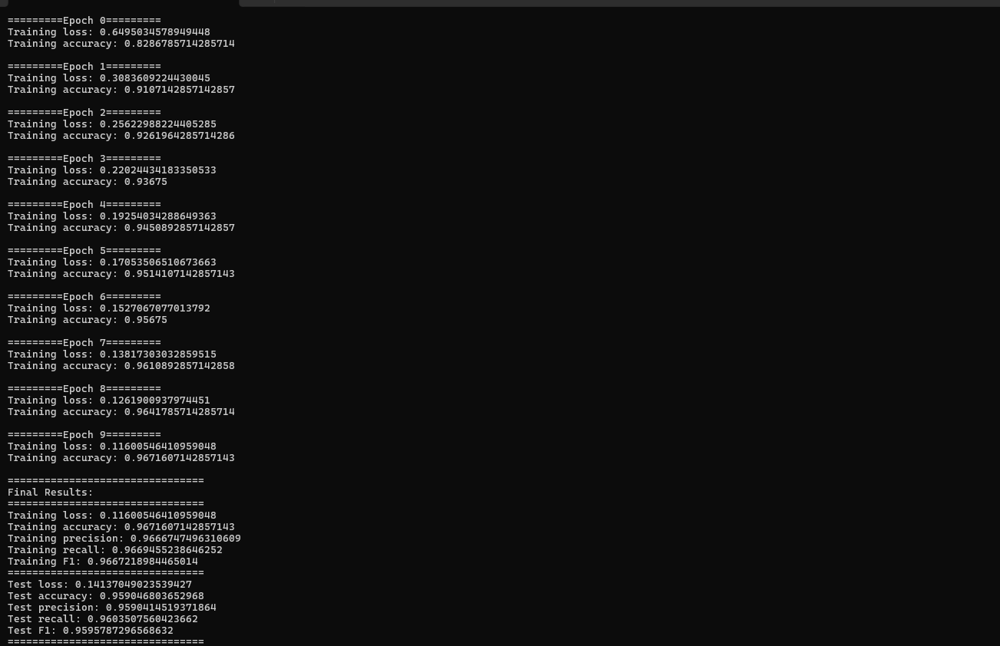

# nanograd-lite

A minimal autodiffentiation engine and neural network library built from scratch.Numpy only, no PyTorch.

Supports forward and backward passes through a dynamic computation graph, a neural network API modelled after PyTorch, and computation graph visualization. Trained on MNIST.

>If you are looking for the process /learnings , check out LEARNINGS.md 

```
pip install nanograd-lite
```

---

## Quick start

```python
from nanograd import Tensor
from nanograd.nn import Sequential, Linear, ReLU, CrossEntropyLoss, SGD

# define a network
model = Sequential(Linear(784, 128),ReLU(),Linear(128, 64),ReLU(),Linear(64, 10))

loss_fn = CrossEntropyLoss()
optimizer = SGD(model.parameters(), lr=0.01)

# training step
x = Tensor(X_batch)          
out = model(x)               
loss = loss_fn(out, y_batch)
loss.backward()
optimizer.step()
optimizer.zero_grad()
```

## Autograd

```python
import numpy as np
from nanograd import Tensor

x = Tensor(np.array([[1.0, 2.0], [3.0, 4.0]]))
y = Tensor(np.array([[0.5], [1.5]]))

z = (x @ y).sum()
z.backward()

print(x.grad)   # dz/dx
print(y.grad)   # dz/dy
```

## Computation graph visualization

```python
from nanograd.viz import draw_dot

x = Tensor(np.array([2.0]))
y = Tensor(np.array([3.0]))
z = (x * y + x).sum()
z.backward()

dot = draw_dot(z)
dot.render("graph", view=True)   
```


---

## What's implemented

**Tensor ops** — `+`, `-`, `*`, `/`, `**`, `@` (matmul), `sum`, `mean`, `reshape`, `transpose`, `exp`, `log`

**Activations** — `relu`, `tanh`, `sigmoid`, `softmax`

**Layers** — `Linear` (Xavier init), `ReLU`

**Loss** — `CrossEntropyLoss`, `MSELoss`

**Optimizer** — `SGD`

**Viz** — `draw_dot`, `trace` (graphviz-based, local use)

---

## MNIST results

Trained a `784 → 128 → 64 → 10` network with ReLU activations, SGD lr=0.01, batch size 32, 10 epochs.




---

## Run the tests

```bash
git clone https://github.com/duaasiraj/nanograd
cd nanograd
pip install -e ".[dev]"
pytest tests/ -v
```

---

## Project structure

```
nanograd/
├── nanograd/
│   ├── engine/
│   │   ├── tensor.py       # Tensor class, all ops + backward rules
│   │   └── utils.py        # topo sort, unbroadcast, gradient_check
│   ├── nn/
│   │   ├── layers.py       # Linear, ReLU
│   │   ├── loss.py         # CrossEntropyLoss, MSELoss
│   │   ├── optim.py        # SGD
│   │   ├── sequential.py   # Sequential container
│   │   ├── modules.py      # base Module class
│   │   ├── accuracy.py     # multiclass accuracy
│   │   └── metrics.py      # precision, recall, F1
│   └── viz/
│       └── graph_viz.py    # draw_dot, trace
├── tests/
│   └── test_gradients.py   # 17 numerical gradient checks
├── demos/
│   ├── mnist_demo.py
│   └── xor_demo.py
└── pyproject.toml
```

---

## License

MIT — see [LICENSE](LICENSE)

## Credits
Visualisation in graph_viz has been taken from Andrej Karpathy's repo. It only supports scalar tensors and was used to get an initial mental model on the flow of gradients and how things were connecting.

> Disclaimer: This project was developed as a learning project and may contain mistakes, inefficiencies, or incomplete implementations. If you spot an issue or have an improvement, feel free to open an issue or submit a pull request. Check out contribution.md for further details :)

